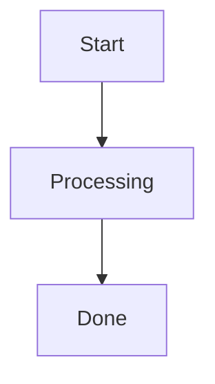
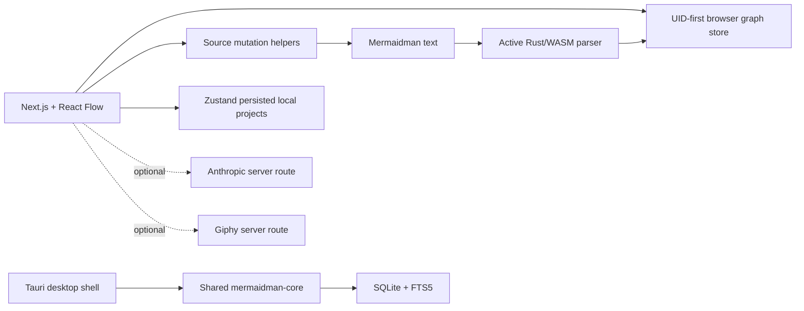

# Mermaidman

> A source-native visual editor for Mermaid flowcharts, powered by React Flow and Rust/WASM.

[](LICENSE)


Mermaidman keeps **Mermaid text as the portable source of truth** while adding a fast visual canvas, stable node/edge identity, layout metadata, rich nodes, nested diagrams, and optional AI-assisted editing.

Canvas edits write back to Mermaid-compatible text. Direct text edits are parsed by a Rust engine compiled to WebAssembly. Mermaidman-specific state lives in `%%` comments, so the topology remains readable and standard Mermaid renderers can ignore the extra metadata.

> [!IMPORTANT]
> Mermaidman is currently **alpha software**. The core editor works, but some controls are placeholders and the browser parser intentionally supports a flowchart-focused subset of Mermaid rather than the entire Mermaid grammar.

## Why Mermaidman

Traditional visual diagram editors make the canvas authoritative. Plain-text Mermaid makes the text authoritative but loses manually curated layout and richer node state. Mermaidman combines both models:

- **Text ↔ canvas round-tripping** — edit either representation without maintaining two documents.
- **Stable identities** — Mermaid IDs can remain human-readable while `uid`/`eid` values provide durable internal identity.
- **Layout without proprietary files** — coordinates and metadata are stored in Mermaid comments.
- **Rich graph nodes** — notes, Markdown, code, media, embeds, nested diagrams, shapes, and style metadata.
- **Nested diagrams** — a node can contain another Mermaidman graph and open as a sub-graph.
- **AI co-authoring** — summarize a node, expand it into sub-topics, or generate a nested diagram using Anthropic from a server-side route.
- **Local-first browser projects** — diagrams and undo/redo state are managed locally; no hosted database is required for the web editor.
- **Desktop foundation** — the Tauri shell includes local document I/O, SQLite/FTS5 search, and backlink-oriented data structures.

## Mermaidman format

A Mermaidman document is valid Mermaid topology plus comment directives:



```text
graph TD
A[Start] --> B[Processing]
B --> C[Done]

%% @node: A {"uid":"n_a1","x":100,"y":120}
%% @node: B {"uid":"n_b1","x":340,"y":120,"kind":"note"}
%% @edge: e_ab {"eid":"e_ab","source":"A","target":"B","label":"next"}
```

Mermaid ignores the `%%` lines. Mermaidman uses them for information such as identity, position, style, rich-node metadata, nested diagrams, and AI provenance.

### Directive conventions

| Directive | Purpose |
| --- | --- |
| `%% @node: <id> {...}` | Node identity, position, kind, style, rich metadata |
| `%% @edge: <eid> {...}` | Edge identity and source/target metadata |
| `%% @ai: <key> {...}` | Optional AI action provenance / audit trail |

For new writes, use valid JSON inside directives. The active web parser also accepts the older loose spatial form such as `{ x: 100, y: 50 }` for backwards compatibility.

## Architecture



There are currently **two Rust parsing paths**:

1. `apps/web/src/rust-engine/` — the active browser engine. This is the parser loaded by the Next.js editor and currently has the broadest flowchart syntax coverage.
2. `crates/mermaidman-core/` + `crates/mermaidman-wasm/` — the shared core used by the Tauri path and an alternate WASM binding.

They are not yet fully unified. See [`docs/PROJECT_AUDIT.md`](docs/PROJECT_AUDIT.md) for the current architectural risks and recommended consolidation path.

## Repository layout

```text
.
├── apps/web/                         # Next.js 16 web editor
│   ├── src/components/               # Canvas, nodes, project UI, insert drawer
│   ├── src/store/                    # Browser graph + local project stores
│   ├── src/utils/                    # Mermaidman source mutation / export helpers
│   ├── src/app/api/                  # Optional Anthropic + Giphy proxies
│   └── src/rust-engine/              # Active Rust parser compiled to WASM
├── crates/mermaidman-core/           # Shared Rust graph/parser/reconcile/write core
├── crates/mermaidman-wasm/           # WASM bindings around the shared core
├── src-tauri/                        # Desktop shell, local files, SQLite/FTS5
├── docs/                             # Design notes, roadmap, audit
└── packages/                         # Workspace package area
```

The bundled `radical-ai-studio-kit` under the web component tree supplies several UI primitives used by the editor and also contains auxiliary CRM/demo material that is not part of Mermaidman's core runtime.

## Quick start

### Prerequisites

- Node.js 20+
- pnpm 11 (the repository pins `pnpm@11.5.1`)
- Rust stable
- [`wasm-pack`](https://rustwasm.github.io/wasm-pack/)

### Run the web editor

```bash
git clone https://github.com/devrobinransom/mermaidman.git
cd mermaidman
corepack enable
pnpm install

# Required on a fresh clone: builds the active browser parser and copies
# its JS/WASM assets into apps/web/public/wasm.
pnpm wasm:build

pnpm dev
```

The custom dev launcher starts at port `3000` and scans upward when that port is already in use.

> [!NOTE]
> The root `wasm:build` script currently uses the POSIX `cp` command. Windows contributors can run the equivalent `wasm-pack build --target web` inside `apps/web/src/rust-engine` and copy `mermaidman_engine.js`, `mermaidman_engine_bg.wasm`, and `mermaidman_engine.d.ts` into `apps/web/public/wasm/`.

## Optional integrations

The editor works without external API keys. Copy the example environment file only when you need AI or GIF search:

```bash
cp apps/web/.env.example apps/web/.env.local
```

```dotenv
# AI: Summarize / Expand / Diagram actions
ANTHROPIC_API_KEY=

# GIF search in the Media drawer
GIPHY_API_KEY=
```

Both keys are read by server-side Next.js routes and are not intentionally exposed to browser code.

> [!WARNING]
> Do not expose a public deployment with a funded `ANTHROPIC_API_KEY` until authentication and/or rate limiting is added to `/api/ai`. The current alpha route is intentionally simple and does not provide abuse protection.

## Development commands

From the repository root:

```bash
pnpm dev          # Next.js development server
pnpm dev:raw      # Next.js directly, without the open-port helper
pnpm build        # production web build
pnpm lint         # web lint
pnpm wasm:build   # build active browser Rust engine -> public/wasm
```

Useful Rust checks:

```bash
cargo test -p mermaidman-core
cargo test --manifest-path apps/web/src/rust-engine/Cargo.toml
```

The Tauri workspace may require platform-specific desktop build dependencies.

## Current feature status

| Area | Status |
| --- | --- |
| Text ↔ canvas parsing | Working |
| Node drag/layout directives | Working |
| Connector create/reconnect/delete | Working |
| Flowchart shapes and link styles | Working subset |
| Local projects | Working (browser persistence) |
| Undo/redo | Working |
| Nested diagrams | Working |
| Media URL / Giphy insertion | Working; Giphy key optional |
| Anthropic AI actions | Working when configured |
| `.mmd` export | Implemented; see audit for known active-file bug |
| Share / collaboration | Placeholder |
| Tauri local I/O + search foundation | Implemented foundation |
| Real-time collaboration / CRDT | Not implemented |

## Compatibility philosophy

Mermaidman should remain friendly to the Mermaid ecosystem:

1. Keep topology human-readable.
2. Store Mermaidman-only data in comments rather than inventing a proprietary container format.
3. Preserve stable identities across label/layout changes.
4. Prefer deterministic, diff-friendly source mutations.
5. Keep hot canvas interactions out of full-text parsing whenever practical.

The active parser is deliberately a **flowchart-focused Mermaid subset**, not a replacement for Mermaid's complete parser. Contributions that expand syntax support should include round-trip tests.

## Contributing

Contributions are welcome. Please read [`CONTRIBUTING.md`](CONTRIBUTING.md) before opening a pull request.

- Bugs and regressions: use the bug report template.
- Feature proposals: use the feature request template.
- Security issues: follow [`SECURITY.md`](SECURITY.md) and do not publish sensitive vulnerability details in a normal issue.
- Community expectations: see [`CODE_OF_CONDUCT.md`](CODE_OF_CONDUCT.md).

## Project audit

A code-level audit of the first-party application/runtime paths is maintained in [`docs/PROJECT_AUDIT.md`](docs/PROJECT_AUDIT.md). It covers the web editor, active WASM engine, browser stores/source mutators, shared Rust core, and Tauri foundation, while excluding generated binaries/glue, lockfiles, and most auxiliary demo-kit code.

## License

Mermaidman is licensed under the [MIT License](LICENSE). Third-party packages and separately sourced components remain subject to their respective licenses and notices.
